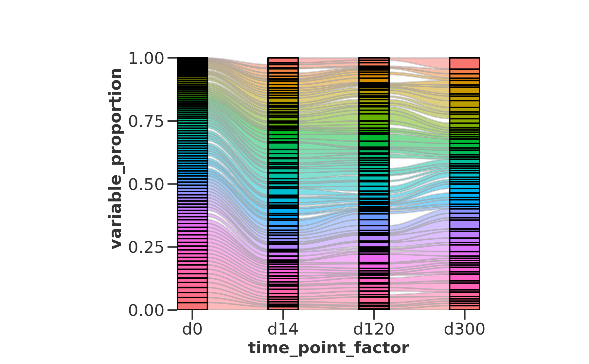

# BarcodeFlow

Simplifies making pre-arranged alluvial plots for biological data.

# Install

```r
devtools::install_github('agmcfarland/BarcodeFlow')
```

# Example

```r
library(BarcodeFlow)

data(df_barcodes, package = 'BarcodeFlow')

df_barcodes <- BarcodeFlow::FormatData(df_barcodes, 'sample_name', 'barcode', 'dpi', 'proportion')

p1 <- BarcodeFlow::BasicAlluvialPlot(df_barcodes)

print(p1)
```




# Dependencies

BarcodeFlow was developed using `R version 4.1.3 (2022-03-10)`.

| package    | version |
| ---------- | ------- |
| dplyr      | 1.0.9   |
| tidyr      | 1.2.0   |
| ggplot2    | 3.3.6   |
| ggalluvial | 0.12.5  |